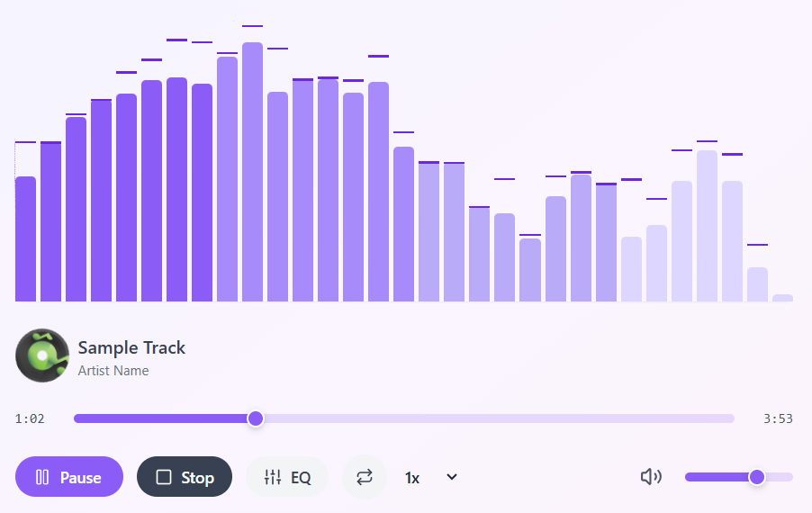
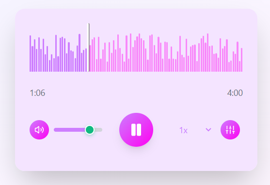
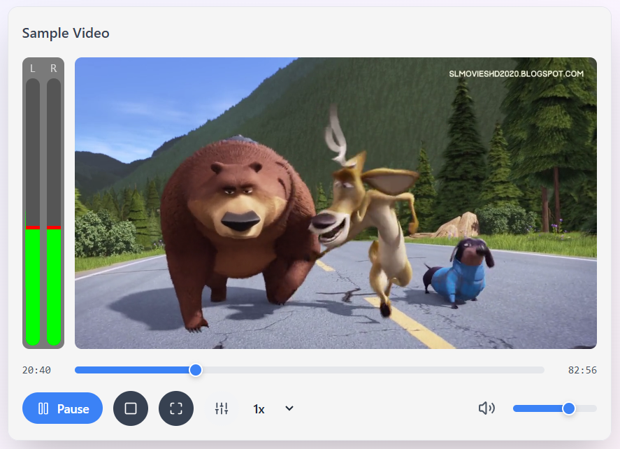

# ecplayer

A premium, highly customizable, and beautiful music player library for React.

[](https://player.evelocore.com/)

## 📖 Documentation

For full documentation, live demos, and interactive examples, visit:
**[player.evelocore.com](https://player.evelocore.com/)**

## 🚀 Installation

```bash
npm install ecplayer
# or
yarn add ecplayer
```

## 🎨 Visual Players

### VisualizePlayer


### WaveAudioPlayer


### NanoAudioPlayer


### VideoPlayer


## 🛠️ Features

- **Beautiful Visualizers**: Real-time audio visualization using Web Audio API.
- **Multiple Player Types**: Choose from `VisualizePlayer`, `WaveAudioPlayer`, and `NanoAudioPlayer`.
- **Built-in Themes**: Multiple premium themes (Rainbow, Ocean, Sunset, etc.).
- **Equalizer**: 3-band equalizer (Bass, Mid, Treble).
- **Speed Control**: Adjust playback speed from 0.5x to 2.0x.
- **Video Support**: Includes a `VideoPlayer` with visualization capabilities.
- **Responsive**: Works perfectly on all screen sizes.
- **License**: MIT
